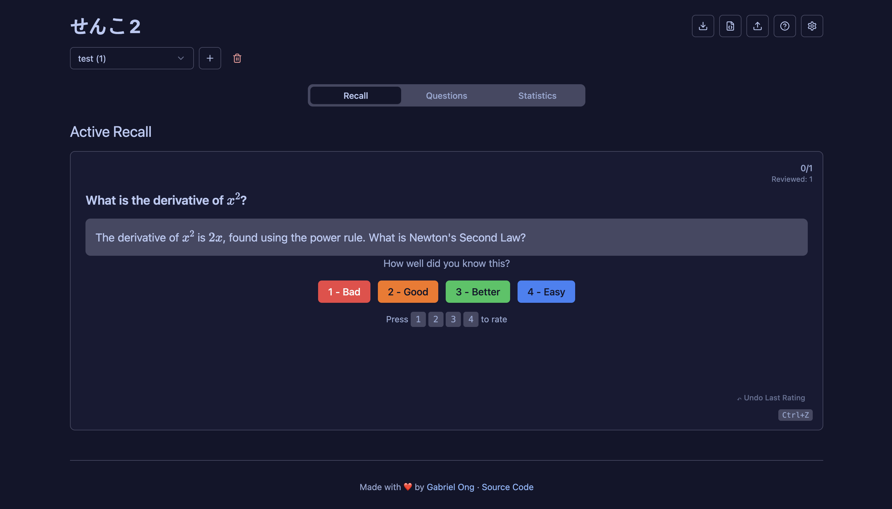

[](https://github.com/gongahkia/senko-2/releases/tag/1.0.0)

# `せんこ 2`

Memorise things faster.

## Stack

* *Frontend*: [React](), [TypeScript]()
* *Deploy*: [Github Actions](), [Github Pages]()

## Usage

The easiest way to use `せんこ 2` is via the ***Live Web App*** at [gabrielongzm.com/senko-2](http://gabrielongzm.com/senko-2/).

Alternatively, you can build it locally with the below.

1. Execute these commands.

```console
$ git clone https://github.com/gongahkia/senko-2 && cd senko-2 && npm install
$ npm run dev
$ npm run build
```

## Screenshots



## Other notes

Also see [`senko`](https://github.com/gongahkia/senko).
